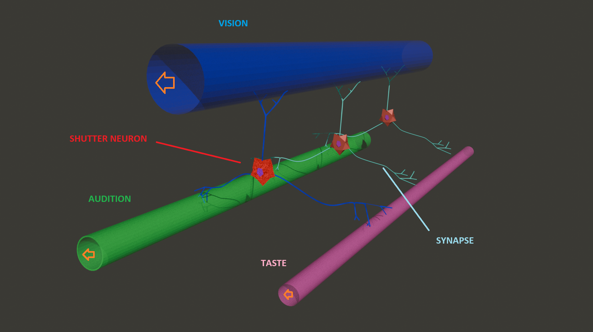

# Shutter Tube Theory

*A New AI Architecture to Revolutionize Memory and Computation*

* **Author:** Ryuku Logos
* **First documented:** 2025-06-14

## Abstract
The Shutter Tube Theory is a novel AI architecture proposed to solve the fundamental problems of current deep learning, such as computational cost, symbol grounding, and the separation of memory and computation. This theory introduces the "Tube," which treats sensory input as a temporal stream of information, and the "Shutter Neuron," which captures arbitrary cross-sections of this stream and imprints them onto synaptic strengths. This allows AI not merely to "memorize" the world as data, but to "experience" it, much like a human being.

---
 

# シャッターチューブ理論

* **提唱者:** Ryuku Logos
* **初版記録日:** 2025年6月14日

## 概要
シャッターチューブ理論は、現行の深層学習が抱える計算コスト、シンボルグラウンディング、記憶と計算の分離といった根本的な問題を解決するために提唱された、全く新しいAIアーキテクチャである。本理論は、感覚入力を時系列的な情報の流れとして捉える「チューブ」と、その流れの任意断面をシナプス強度に焼き付ける「シャッターニューロン」を中核概念とする。これにより、AIは世界をデータとして「暗記」するのではなく、人間のように「経験」として記憶することが可能となる。

---

## Links / 関連リンク

### Live Articles / 公開記事
* **[Read on Medium (English Version)](https://medium.com/@rikudatian0/why-deep-learning-fails-a-new-ai-theory-to-revolutionize-memory-and-computation-c18b7143ffd2)**
* **[Read on Note (日本語版)](https://note.com/sadsdartdawr/n/ndc6d5ffed893)**

### Permanent Record (First Edition PDF) / 完全な記録（初版PDF）
The following PDF files fix the first edition of the articles published on each platform with the timestamp of this repository.

以下のPDFファイルは、各プラットフォームで公開された記事の初版を、このリポジトリのタイムスタンプと共に固定したものです。

* **[English Version (Medium) - First Edition PDF](./shutter-tube-theory-en.pdf)**
* **[日本語版 (Note) - First Edition PDF](./shutter-tube-theory-jp.pdf)**

---

## Conceptual Diagram / 基本概念図

## License / ライセンス
This work is licensed under a [Creative Commons Attribution 4.0 International License](http://creativecommons.org/licenses/by/4.0/).
